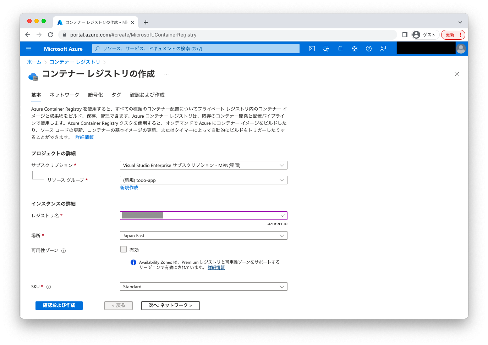
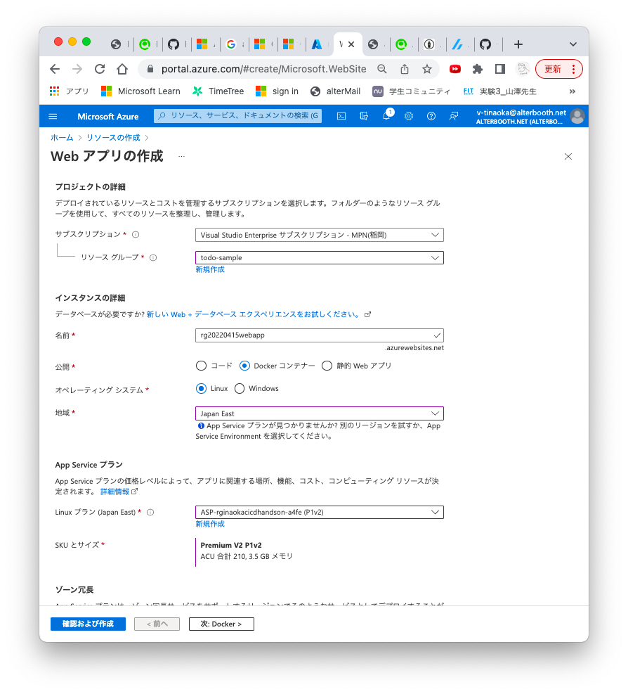
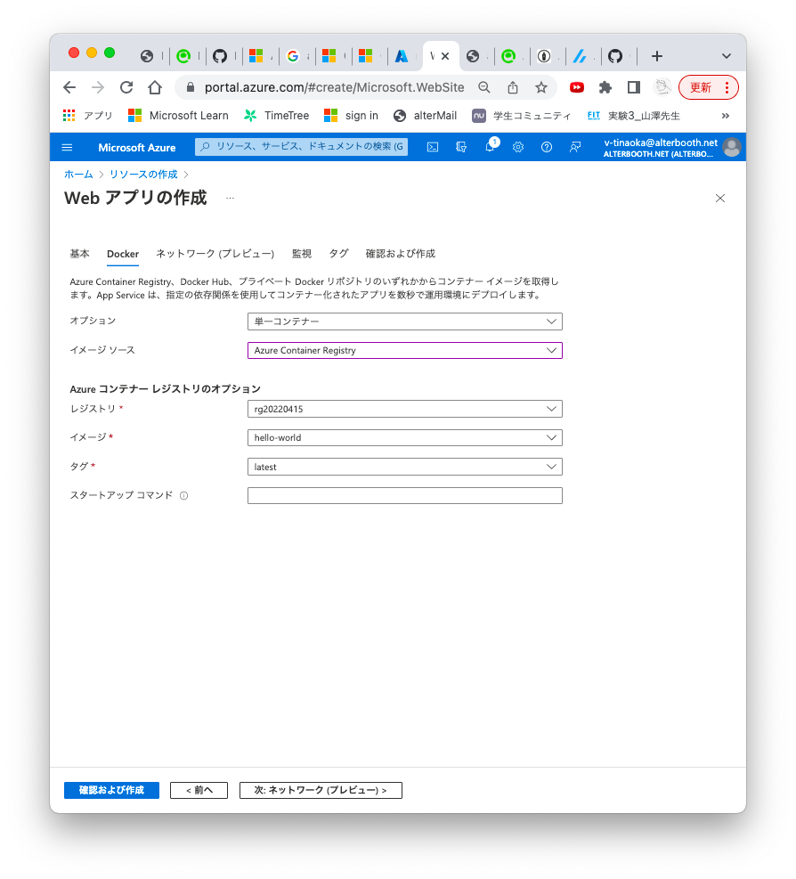
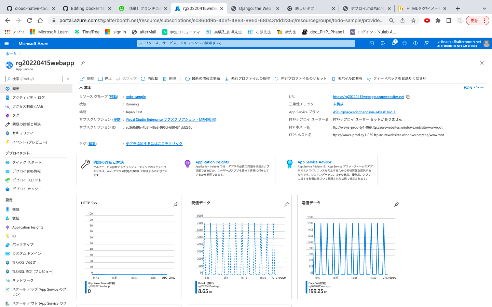
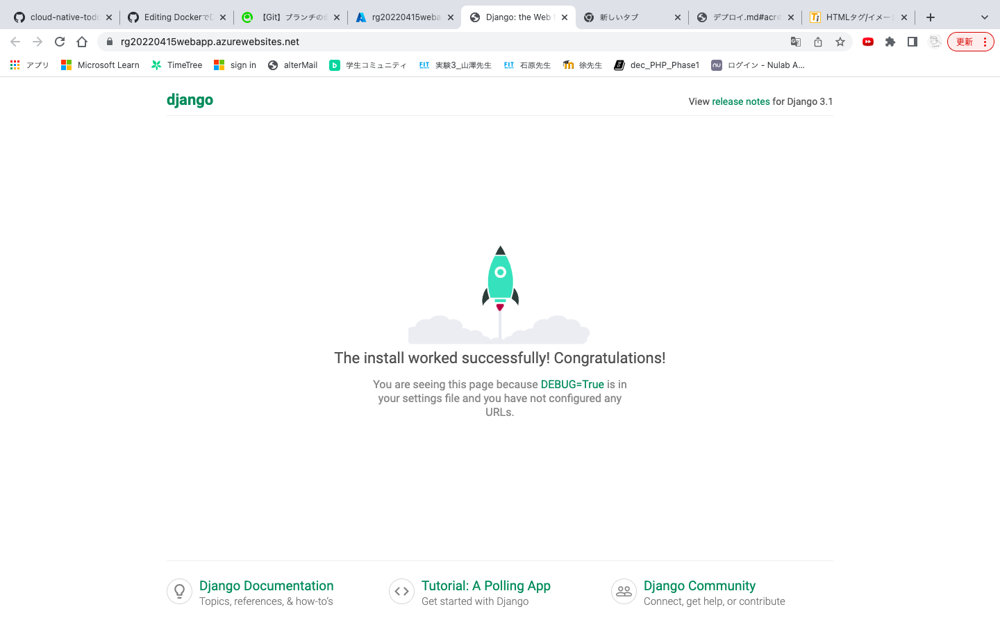

# Azureにデプロイ
まず、先ほどのロケットの画面の状態をデプロイ。次に表示をHello,World.に変更、それをもう一度デプロイする。

### 手順の流れ
* [ACR作成(Azureで作業)](#arc作成)
* [ACRのレジストリにDockerイメージをプッシュ(ローカルで作業)](#acrのクイックスタートローカルで作業)
* [AppServiceの作成とデプロイ](#webappを作成azureで作業)

## ARC作成(Azureで作業)
[https://portal.azure.com/](https://portal.azure.com/)にアクセス。

「コンテナレジストリ」と検索しコンテナレジストリのページを開く。
作成を押し、以下の画像のように入力する。

### ACRの設定
ローカルPCからACRにログインするために必要な設定を行います。

設定→アクセスキー→管理者ユーザを有効


## ACRのクイックスタート(ローカルで作業)
作成したコンテナレジストリのクイックスタートのコマンドを使用すると簡単にできます。(**3.ログイン**と**4.プッシュ**のコマンドを使用します)


### 1.ACRにログイン
usernameとpwは、ARCのアクセスキー使用(ARC作成で設定したやつ)

```
docker login レジストリ名.azurecr.io
```
### 2.レジストリにプッシュ
まず、イメージの前にレジストリ ログイン URI を付加し、プライベート レジストリにプッシュできるようにしましょう。

レジストリにアップロードするためにイメージにタグを付け、イメージをプッシュします。

```
docker tag hello-world レジストリ名.azurecr.io/hello-world
docker push レジストリ名.azurecr.io/hello-world
```

## Webappを作成(Azureで作業)



確認および作成のポタンを推し作成する。
## デプロイ完了
デプロイが完了すると、webappに移動します。




## 参考サイト
* [Azure App Service を使ってコンテナー化された Web アプリをデプロイして実行する](https://docs.microsoft.com/ja-jp/learn/modules/deploy-run-container-app-service/)
* [コンテナのGithub Actions](https://docs.microsoft.com/ja-jp/azure/app-service/deploy-container-github-action?tabs=service-principal)
* [AzureにDjangoで作ったwebアプリのContainerをデプロイしてみる](https://zenn.dev/ibaraki/scraps/a7b7fd0592e228)

