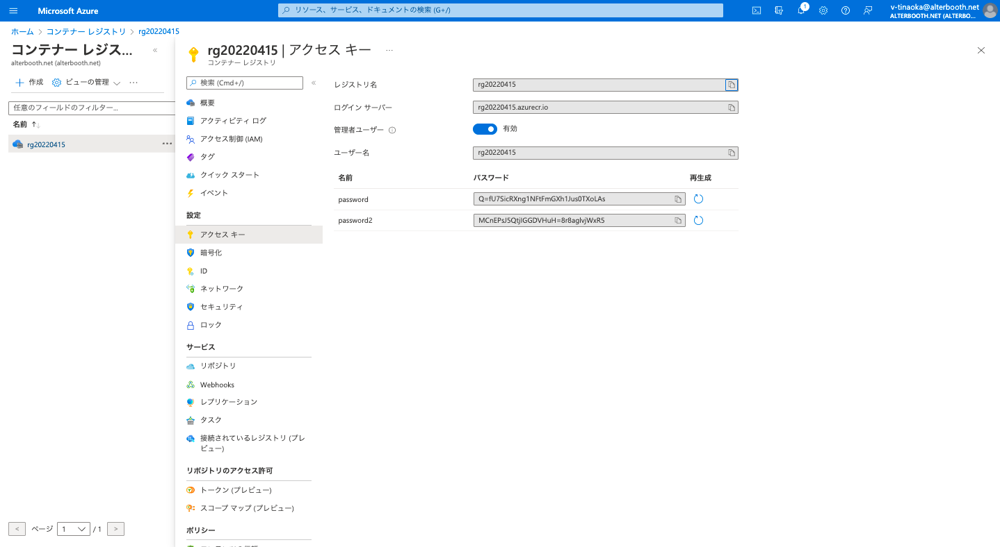
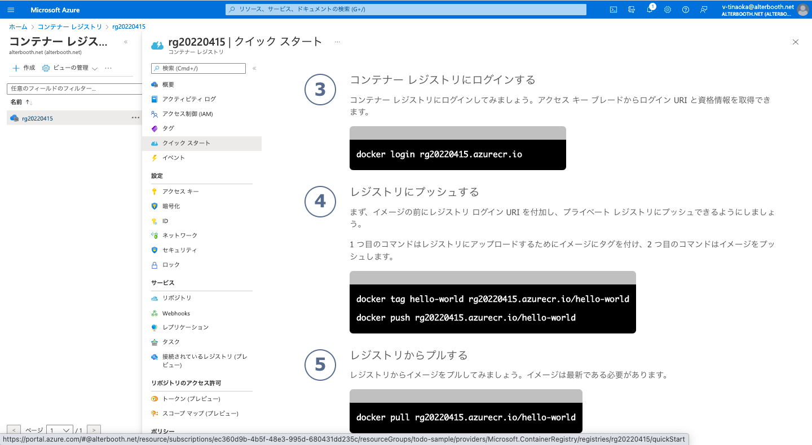
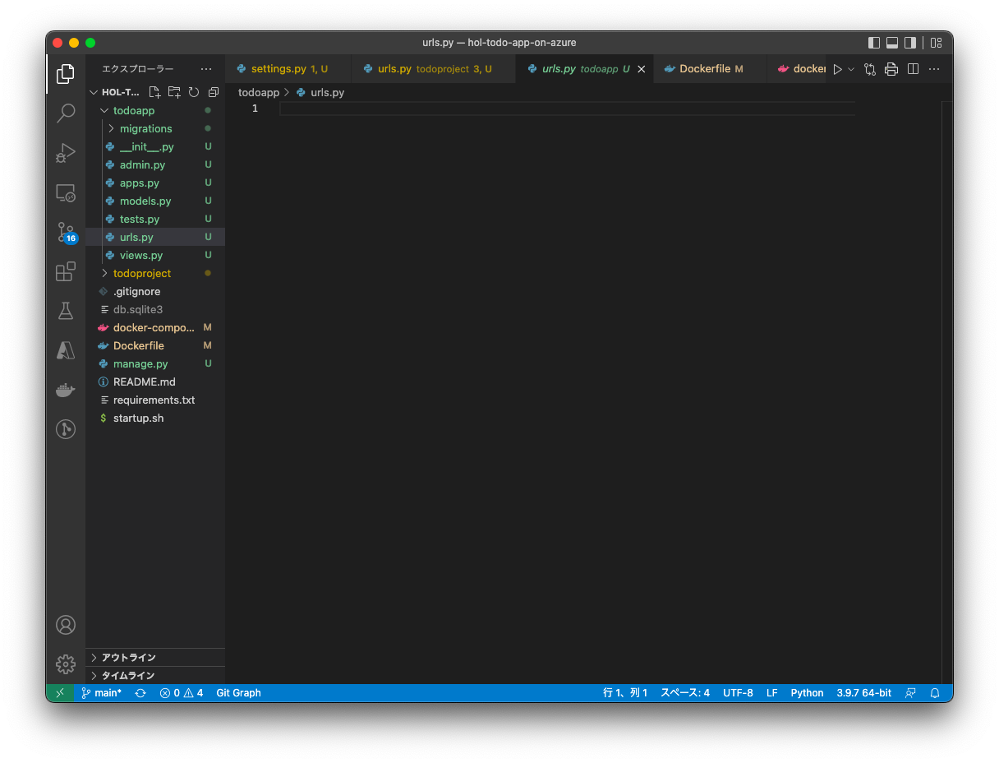

#  デプロイ
* AzureのACRでレジストリを作成し、Dockerイメージのプッシュ
* AzureのApp Service for Containerを作成し、デプロイ
* 表示をロケットから、Hello Worldへ変更


----

# ACRの作成(Azureで作業)
[https://portal.azure.com/](https://portal.azure.com/)にアクセス。<br><br>
「 **コンテナレジストリ** 」と検索しコンテナレジストリのページを開く。<br>
「 **作成** 」を押し、以下のように入力する。
* リソースグループ: 「 **todoapp** 」(他の文字でも可)
* レジストリ名:  **任意の文字** 
* 場所: 「**Japan East**」
* SKU: 「**Basic**」
作成後、「リソースに移動」をクリック。
### ACRの設定
ローカルPCから **ACRにログインするために必要な設定** を行います。<br>
**設定** → **アクセスキー** → **管理者ユーザを有効**


## ACRのクイックスタート(ローカルで作業)
### ビルドしてイメージを作成
```
docker build -t hello-world . 
```


### AECログイン&イメージのプッシュ
作成したコンテナレジストリの **クイックスタート** のページを開きます。<br>クイックスタートのコマンドは自分のコンテナレジストリの名前になっているので、 **コピー&ペーストで簡単に実行できます** 。<br>(**3.ログイン**と**4.プッシュ**のコマンドを使用します)


## リポジトリ確認
Azureの ホーム > コンテナレジストリ > レジストリ名  に移動します。<br>
リポジトリに自分のイメージがプッシュされているか確認する。<br>
確認ができたら、ACRの作成は終了です。

----

# App Serviceの作成(Azureで作業)
[https://portal.azure.com/](https://portal.azure.com/)にアクセス。 <br><br>
「 **app service** 」と検索しApp Serviceのページを開く。<br>
「 作成 」を押し、以下のように入力する。
* リソースグループ： todoapp (ACRと同じもの)
* webアプリ名：　任意の名前
* 公開：　Dockerコンテナー
* os: Linux
* 地域：　Japan East
* Linuxプラン：　　新規作成→プラン名「F1」
* SKUとサイズ: 「開発/テスト」の「無料のもの」を選択

Dockerへ
* オプション：単一コンテナー
* イメージソース：　Azire Container Registry
* レジストリ：　先ほど作成したもの
* イメージ： hello-world
* タグ： latest

作成をクリック
## 作成完了
App Serviceの作成が終わったら、作成されたApp Serviceに移動して作業を進めます。

## 環境変数の設定

App Service→「構成」→「新しいアプリケーションの設定」に、docker-compose.ymlに書かれている SECRET_KEY を設定します。<br>
**注意**： 保存ボタンを押すのを忘れないでください。

## 確認
「概要」→「URL」のurlからサイトに移動できます。
起動するまでに少し時間がかかりますが、これでデプロイ先でもロケット打ち上げ成功です。

> **※Mac(M1)で本手順を実施する際の注意**  
M1のMacからAzureへのデプロイを行った際、アプリケーションが正常に動作しない場合がございます。  
ハンズオン中にエラーが発生した場合は、お近くのスタッフにお声掛けください。  
また、エラーが解消しない状態でハンズオンの続きを実施する際は、本章のステップは一度スキップして頂き、次の章 [CI/CD](./cicd.md) へお進みください。

----

# Hello world(VSCodeで作業)
次に、ロケットの画面ではなく、「Helloworld」と表示されるように変更します。

apps.pyに記述された、アプリ名をsettings.pyに登録します。

↓todo/apps.py
```
name = 'todo'　　#ここのアプリ名をsettings.pyに登録する
```

↓todoproject/settings.py
```
INSTALLED_APPS = [
    'django.contrib.admin',
    'django.contrib.auth',
    'django.contrib.contenttypes',
    'django.contrib.sessions',
    'django.contrib.messages',
    'django.contrib.staticfiles',
    #追加
    'todo',
]
```


## ルーティングの設定１
次にルーティングの設定を行います。
サーバにアクセスされた時にアプリのurls.pyを使用する設定を記入します。

todoproject/urls.py
```
from django.contrib import admin
from django.urls import path, include # include 追加

urlpatterns = [
    path('admin/', admin.site.urls),
    # 追加
    path('', include('todo.urls')),
]
```

## ルーティングの設定２
サーバにアクセス→プロジェクトのurls→アプリのurls の流れですが、アプリのurlsが無いので新規作成します。

↓コマンドでファイルを新規作成。GUIで作成してもOKです。
```
touch todo/urls.py
```

## ルーティングの設定３
サーバに、https://サーバドメイン/hello のアクセスが来たら

views.pyのindex()関数を呼び出すように設定します。

↓todo/urls.py
```
from django.urls import path

from . import views

urlpatterns = [
    path('hello', views.index),
]
```

## viewsの関数を作成
views.pyにindex())関数の処理を記述します。

↓todo/viwes.py
```
from django.shortcuts import render
from django.http import HttpResponse

def index(request):
    return HttpResponse('Hello World')
```


## 動作確認
変更を確認してみましょう。

```
docker compose up
```
を実行し、[localhost:8000/hello](http://localhost:8000/hello)にアクセス。<br>
「Hello World」と表示できたら成功です。<br><br>


サーバ停止：ctrl + c
```
docker compose down
```

## 再デプロイ
では、もう一度デプロイをしてみましょう。 ※hello-world-2 に注意
```
docker build -t hello-world .
docker tag hello-world レジストリ名.azurecr.io/hello-world-2
docker push レジストリ名.azurecr.io/hello-world-2
```
今回は、前回からの差分のみプッシュされるので、すぐに終わります。

* pushが終わったらApp Serviceに移動します。
* デプロイセンターに移動し、イメージで「hello-world-2」を選択し、**保存**します。
* 設定が保存されると再デプロイされます。(デプロイするのに時間がかかります)
* デプロイが終わると、https://サーバドメイン/hello にアクセス
* 「Hello World」と表示されたら成功です。


## 次へ
次はCI/CIです。<br>
[CI/CDの資料](cicd.md)   


[READMEに戻る](../README.md)


