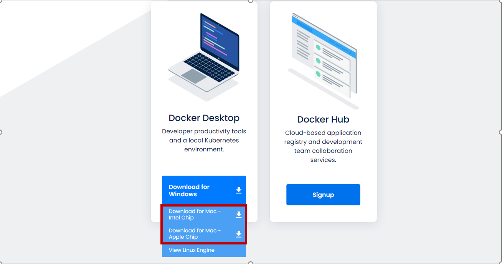

[戻る](環境構築.md)
# Docker環境構築 Mac用

## 手順1
[git](https://git-scm.com/download/mac)のインストール<br>
Homebrewをインストール済みの方は以下のコマンドでgitのインストールを行ってください。<br>
```
$ brew install git
```
Homebrewがインストールされていない場合は以下のコマンドを入力し、Homebrewのインストールを行ってください。
```
/bin/bash -c "$(curl -fsSL https://raw.githubusercontent.com/Homebrew/install/HEAD/install.sh)"
```

## 手順2
[Docker](https://www.docker.com/get-started/)のインストール<br>
↑にアクセスし、下記画像の赤枠からご自身の環境に適したものをダウンロードしていただき、インストールを行ってください。<br>
<br>
### Mac本体の内臓チップの調べ方
Mac本体の左上のリンゴマークから「このMacについて」というボタンを押して確認してください。
<br>そこにintelかappleのCPUチップが書かれています<br>



# 参考動画
[【Docker超入門 #2】環境構築 for Mac](https://www.youtube.com/watch?v=OQ5m9iEbRu0&t=0s)