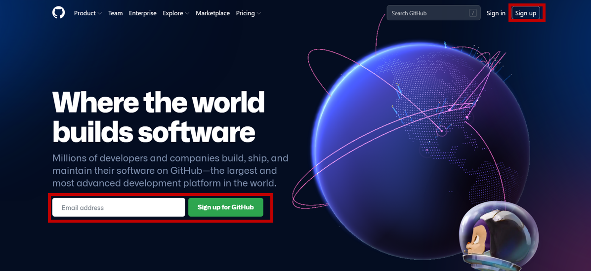

# Githubアカウントの作り方
[Github](https://github.com/)にアクセスし、アカウントの作成方法は２つあり、下記画像の右上の赤い枠線(Sign Up)を押して登録する方法と左下の赤い枠線からご自身のEmailアドレスを入力していただき作成する方法があります。そこからサイトの指示にしたがって登録お願いします。githubのログインはE-mailとパスワードでログインするため、ログインできるよう覚えておいてください。

## YouTube動画
githubを知らない方や、上の方法で分からない方は参考にしてください。

- [【超入門編】 GitHubの使い方 シリーズ ① GitHubアカウント登録手順](https://www.youtube.com/watch?v=SYVu3DymYfc)
- [【超入門編】 GitHubの使い方 シリーズ ② GitとGitHubの違いとは？](https://www.youtube.com/watch?v=A4gSBUSAjNw)
- [【超入門編】 GitHubの使い方 シリーズ ③ リポジトリの作成から削除までの紹介](https://www.youtube.com/watch?v=FIp142zbMps)
- [【超入門編】 GitHubの使い方 シリーズ ④ 初心者が知るべきリポジトリの機能](https://www.youtube.com/watch?v=zYsvftVsWMs)
- [【超入門編】 GitHubの使い方 シリーズ ⑤ GitHub Flowを活用した開発方法](https://www.youtube.com/watch?v=Q2oLox6-yTM)